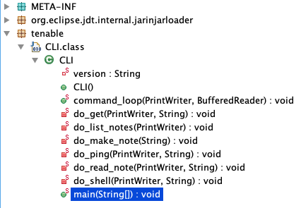
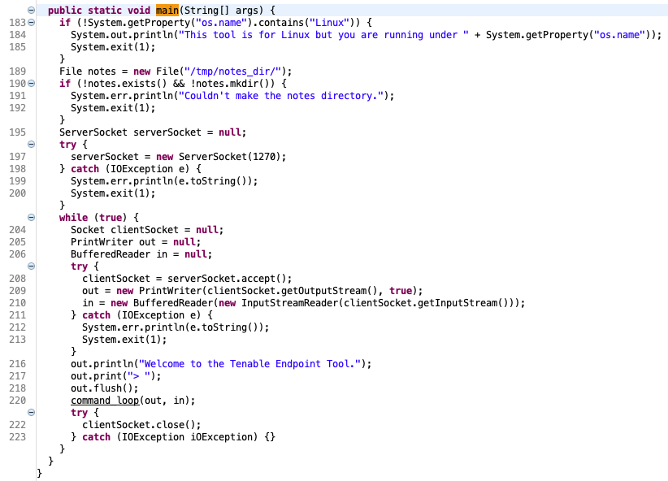
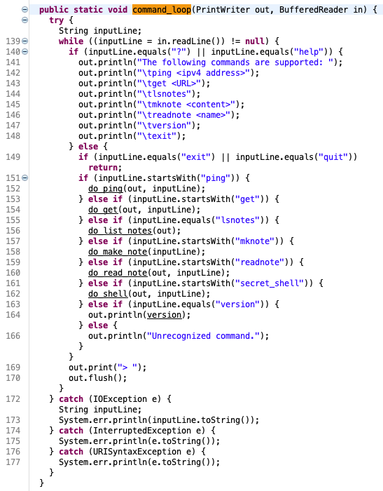

# Tenable Zero Day Assessment Writeups - jiva

```
Challenge 1: tenable_cli.jar
===
As much as it pains me to admit it, not every tool is written in C or C++. It's important for a vulnerability hunter to be able to handle other languages: Python, Lua, Java, Go, js, etc. This challenge is written in Java. For this task, find as many vulnerabilities in tenable_cli.jar as you can. Do not overthink this. If you are hunting outside of CLI.class then you've gone too far.

Deliverables:
1. A write up describing how you approached the hunt and found the vulnerabilities.
2. PoC scripts for each vulnerability. Please provide individual scripts for each PoC.
```

I started off this challenge by grabbing my go-to jar decompiler, JD-GUI (http://java-decompiler.github.io/).

Upon loading `tenable_cli.jar` and letting JD-GUI work its decompilation magic, we see a list of some interesting methods in the class `CLI`:



Let's inspect each one and see if we can find any interesting issues.


Starting off in `main()`, we see that the program first checks to see if we're on a Linux system before allowing us to progress any further. If we are, it then attempts to create the directory `/tmp/notes_dir`. After creating this directory, the program spins up a socket listener on TCP port 1270 and starts listening for incoming connections. It then sends a message prompt over the connection and waits for data from the connection. It will then pass any data received into `command_loop()` (via the `in` variable). Let's check out what `command_loop()` does.




We can see that this method defines a set of commands that is allowed by the program. The command names are:
- ping \<ipv4 address\>
- get \<URL\>
- lsnotes
- mknote \<content\>
- readnote \<name\>
- version
- exit

This method checks to see if the input supplied from the connection (from variable `in`) begins with one of the commands listed above, then calls a method corresponding to that command.

Let's start by inspecting what `do_ping()` does.