# Tenable Zero Day Assessment - Challenge 1 Writeup - jiva

```
Challenge 1: tenable_cli.jar
===
As much as it pains me to admit it, not every tool is written in C or C++. It's important for a vulnerability hunter to be able to handle other languages: Python, Lua, Java, Go, js, etc. This challenge is written in Java. For this task, find as many vulnerabilities in tenable_cli.jar as you can. Do not overthink this. If you are hunting outside of CLI.class then you've gone too far.

Deliverables:
1. A write up describing how you approached the hunt and found the vulnerabilities.
2. PoC scripts for each vulnerability. Please provide individual scripts for each PoC.
```

I started off this challenge by grabbing my go-to jar decompiler, [JD-GUI](http://java-decompiler.github.io/).

Upon loading `tenable_cli.jar` and letting JD-GUI work its decompilation magic, we see a list of some interesting methods in the class `CLI`:


Let's inspect each one and see if we can find any interesting issues.


Starting off in `main()`, we see that the program first checks to see if we're on a Linux system before allowing us to progress any further. If we are, it then attempts to create the directory `/tmp/notes_dir`. After creating this directory, the program spins up a socket listener on TCP port 1270 and starts listening for incoming connections. It then sends a message prompt over the connection and waits for data from the connection. It will then pass any data received into `command_loop()` (via the `in` variable). Let's check out what `command_loop()` does.


We can see that this method defines a set of commands that is allowed by the program. The commands are:
- ping \<ipv4 address\>
- get \<URL\>
- lsnotes
- mknote \<content\>
- readnote \<name\>
- version
- exit

This method checks to see if the input supplied from the connection (from variable `in`) _begins_ with one of the commands listed above, then calls a method corresponding to that command.

***

Let's start by inspecting what the method `do_ping()` does.

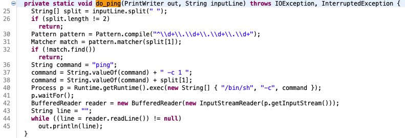

This method is interesting. Right off the bat, we can see there's a shell command being crafted with input that's received from the socket. Let's work our way down this method to see if we can potentially exploit a command injection vulnerability.

On line 25, the method first does a length check after splitting the input on a single space character. If the length of the parts does not equal 2, it returns. However, if it passes this check, the code then compiles a regex pattern which attempts to validate an IPv4 address. This pattern, however, is severely broken because it only checks to see if the "IP address" _begins_ with a dotted-quad notation and fails to end the check with the `$` character (to ensure the input IP address only matches the dotted-quad notation and nothing else). We can easily bypass this regex check by injecting input such as `1.1.1.1;id` for the IP address.

Let's attempt to exploit it:

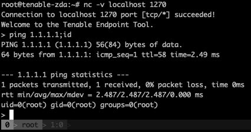

We can see the output of the command `id` and see that we effectively exploited a **command injection vulnerability** (technically a **remote command execution vulnerability**, since the socket listens across all interfaces).

A PoC of this exploit can be found in [`PoCs/pwn_c1_do_ping.py`](PoCs/pwn_c1_do_ping.py)

***

Let's move onto `do_get()`.

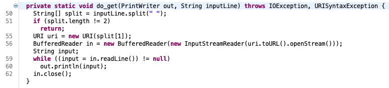

We can see that this method parses the input similar to `do_ping()`, however, instead of building a shell command from the parsed value, it creates a creates a `URI` object from the input URL. The program then calls `openStream()` on `uri`, effectively making a `GET` request to this resource. Let's see it in action:

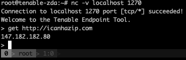

However, there is one critical check missing here. The code is not checking to ensure that the URI scheme is on an allowlist of sorts (e.g. only allowing `http://` or `https://`), and instead, accepts any URI (such as a dangerous one, like `file://`).

Let's see what happens if we try to read the contents of `/etc/passwd` and attempt to exploit an **arbitrary file read vulnerability** :

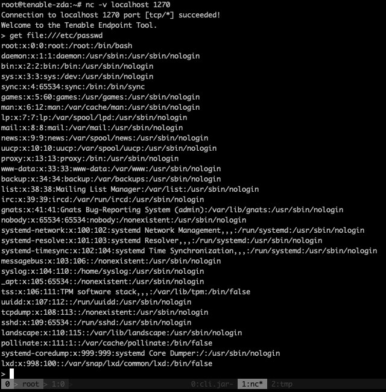

There's another vulnerability here called **Same-Site Request Forgery (SSRF)** that may exist depending on the what's being hosted on the underlying machine. Say for example, that the target serves a webserver on port 9001 to connections originating from the loopback interface. We can leverage the `do_get()` method to access that data. Here's an example:

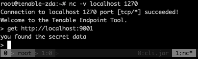

Additionally, if we specify the URL to a large file (say, 1GB of `A`s), we can essentially exploit a Denial-of-Service vulnerability, since the Java process on the server is likely not able to store massive amounts of data in memory and ultimately crash. Here's an example of that:

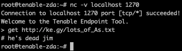

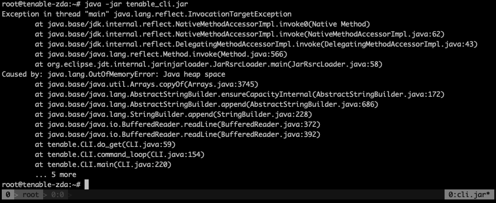

A PoC of the arbitrary file read exploit can be found in [`PoCs/pwn_c1_do_get_arbitrary_file_read.py`](PoCs/pwn_c1_do_get_arbitrary_file_read.py).

A PoC of the SSRF exploit can be found in [`PoCs/pwn_c1_do_get_ssrf.py`](PoCs/pwn_c1_do_get_ssrf.py). Note that you'll need a webserver serving data from port 9001 on the localhost for this PoC to work.

A PoC of the denial-of-service exploit can be found in [`PoCs/pwn_c1_do_get_DoS.py`](PoCs/pwn_c1_do_get_DoS.py).

***

Let's checkout `do_list_notes()` and `do_make_note()`.

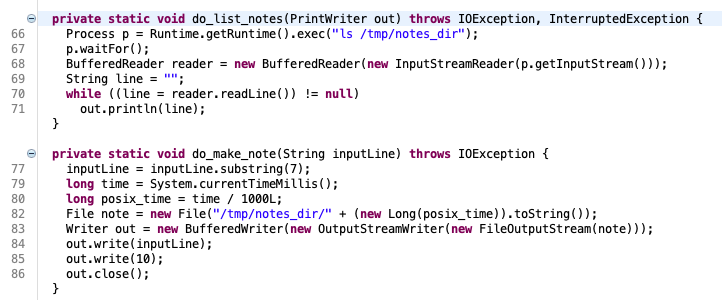

When I first looked at `do_list_notes()`, nothing immediately stood out to me. The method it self doesn't take in any input and appears to only run `ls` on the directory created in `main()` (`/tmp/notes_dir`), after which writing the output to the socket. Moving on to peek at out what `do_make_note()` is doing...

The code in `do_make_note()` takes in input via `inputLine`. From `inputLine`, the code _appears_ to take the substring starting at index 7, then creates a filename based on the current time's epoch (stored in `posix_time`), and stores the value of the sliced `inputLine` into the file `/tmp/notes_dir/<posix_time>` (along with a new line character, which is decimal value `10`). One interesting thing to note is that on my host, the line `inputLine = inputLine.substring(7);` doesn't appear to work. That is, instead of properly begin the substring starting at index 7, it writes the entire input into the file. I'm unsure why this is happening. Maybe it's some Java weirdness that I'm not familiar with? Anyways.

Because of this weirdness, we're able to effectively write a file with an arbitrary file size (up to Java's max heap size), meaning we can effectively exhaust the disk space on the target system and cause a denial-of-service. We can also use this weird to exhaust the heap-space of the Java process and cause a crash, resulting in a denial-of-service vulnerability.

A PoC of the heap exhaustion denial-of-service exploit can be found in [`PoCs/pwn_c1_do_make_note_OOM_DoS.py`](PoCs/pwn_c1_do_make_note_OOM_DoS.py).

A PoC of the disk-space exhaustion denial-of-service exploit can be found in [`PoCs/pwn_c1_do_make_note_exhaust_disk_space_DoS.py`](PoCs/pwn_c1_do_make_note_exhaust_disk_space_DoS.py). *WARNING* probably don't run this =]

***

On to `do_read_note()`:

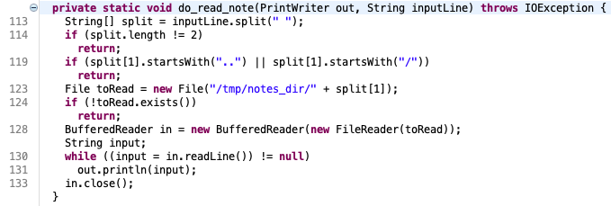

This method is interesting. After ensuring that the command in `inputLine` contains 2 parts, it checks to see if the parsed path value starts with either "`..`" or "`/`". If it does, the method returns. This check is presumably checking for a directory-traversal type of attack. However, it is not implemented properly. This check can bypassed by starting the path with "`./`". Let's see what happens when we specify the path as `./../../../../../../../etc/passwd`:

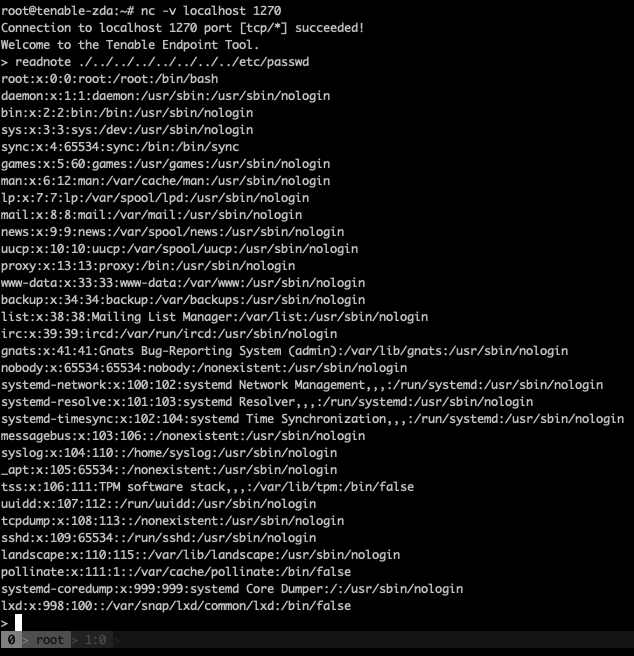

A PoC of the arbitrary file read exploit can be found in [`PoCs/pwn_c1_do_read_note_directory_traversal.py`](PoCs/pwn_c1_do_read_note_directory_traversal.py).

***

Finally, after reviewing the code in `command_loop()` in its entirety, there appears to be a hidden command (or a backdoor?) that can be reached by sending the command `secret_shell` with the second parameter `mikejones`.

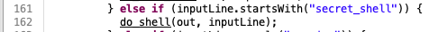

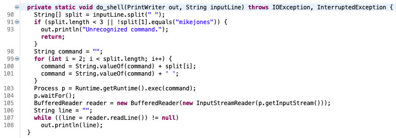

"Exploit" example:

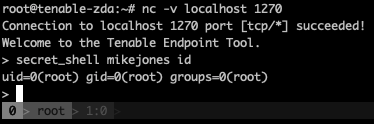

A PoC of the backdoor shell  can be found in [`PoCs/pwn_c1_mikejoooooonnnnneeesss.py`](PoCs/pwn_c1_mikejoooooonnnnneeesss.py).