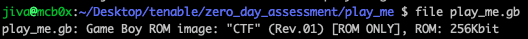
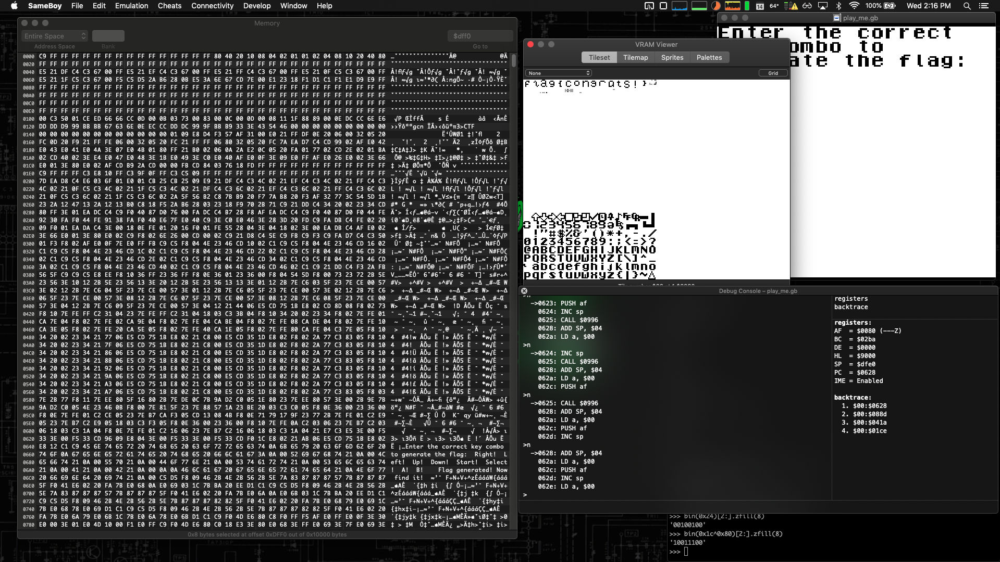
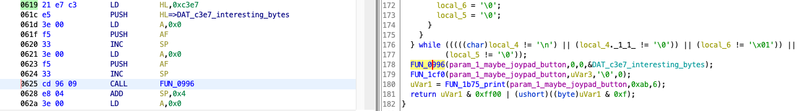
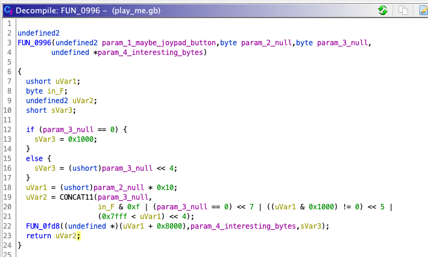
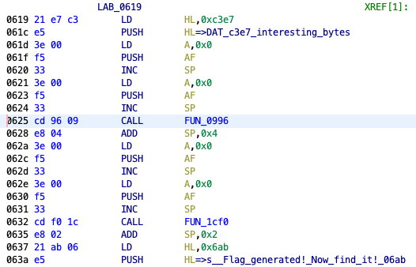

# Tenable Zero Day Assessment - Challenge 2 Writeup - jiva

```
Challenge 2: play_me
===
The play_me file is a CTF challenge based on a Z80-style CPU. We've hidden a flag with the format of "flag{ xxxxx }" somewhere in the application. Your task is to find this flag and provide a write-up on your approach.

Deliverables:
1. A write up describing how you approached the challenge and found the flag (if found).
2. The flag (if found).
```

This sounds fun. I've never played with Z80 or Gameboy ROMs before, so I'm up for the challenge.

Just to get our bearings, let's check what `file` thinks this file is:


A Game Boy Rom, sweet. Let's run it in OpenEmu and see what this game is like:


A message telling us that we need to enter the correct key combo to obtain the flag. Let's see if we can disassemble this file and learn more about whats going on underneath.

I loaded up my vanilla Ghidra instance to see if it would be able to disassemble/decompile the Gameboy file at all... It turns out that it wasn't able to. =[. The functions that it attempted to identify were nonsensical ("RST?") and it wasn't able to disassemble anything with the built-in Z80 language definition.


Time to do some research on tools used to reverse engineer Z80/Gameboy files...BRB.

***

Ok, after searching the web for a few minutes I learned about an awesome Ghidra extension called [GhidraBoy](https://github.com/Gekkio/GhidraBoy). This seemed to do the trick, as I can now see sensible disassembly and also decompiled code!

[This youtube video](https://www.youtube.com/watch?v=dQLp5i8oS3Y) is also a helpful guide in starting out with Gameboy ROM hacking.


At this point, I want to try to find the code that takes in the input for the key-combo and try to follow where that input is going, in an attempt to see if I can find any checks related to the key-combo checking code.

One way to do this is by locating the string "Enter the correct key combo..." in the binary and see what code references it.


We can use the string searching feature in Ghidra to locate strings of ascii values to our specification. We see that the message string is located at address `0x6644`.


We can click on the address of the target string and show all references to this address. This should hopefully lead us to the area of code that reads in the input value.


We see the message prompt is being referenced at address `0x0414`. Let's dissect the code around that address.

The function located at address `0x0384` appears to be some sort of message printing routine. It may even be the main game loop. There's code here that prints out the prompt message, as well as any button you pressed. It also has as a reference to a string that indicates that the flag as been generated and a message for us to find it. I wonder if this is the meat of the logic around reading the input keys and generating the flag. 


The `if` statements in this function (`if (extraout_E ==`) appear to be looping through the bits of a byte, perhaps the byte located at `0xff00` which is the "joypad register" and keeps a byte value corresponding to the current button pushed. The function at `0x1b75` appears to be the actual print() function.

Researching...

Quite a bit of disassembly was not done automatically by Ghidra. I had to go through manually across the binary and explicitly disassembly (D).

Researching...

I decided to change my approach a little bit. I discovered a Gameboy emulator called SameBoy which has a built-in debugger. I loaded up the game and then paused execution to examine what address was being executed. After several pause/continues, I observed that we're stopped at address `0x0860`.


Researching...

I poked around for a bit in Sameboy's debugger. Even tried being slick and thought I could maybe jump the `pc` to a part of the code that I thought might be generating the flag (`eval pc=$0625`):


Eh, I wasn't able to make any progress with that. Maybe I'm just tired.

Researching...

OK - it's past 2am on Monday the 12th and I need to try to get some sleep. I will attack this again tomorrow.

***

Picking back up on Tuesday the 13th in the morning. I have to work, so hopefully I can find some time in-between tasks to give this challenge another attempt.

I think I'm going to watch a few more video tutorials, including the one I posted above again. I also think I'm going to make a better attempt at actually reverse engineering some of the code here so I can make some sense of what's going on.

Working/Researching...

Spending some more time reading the decompiled code starting from `entry()` and in the function at `0x0384`. My goal right now is to find any code that appears to be checking against a hardcoded list of buttons in the correct key combo.

Working/Researching...

I have a sneaking suspicion that this code block might be defining the correct key combo in some way:


The sequence `1 2 1 2 8 8 4 4` is oddly specific and might correspond to a combination of keys that we need to enter. If this is the combo, I need to figure out what buttons these values correspond to.

Working/Researching...

I switched over to Sameboy's debugger so that I can step through some of the code corresponding to this mysterious sequence. The lines highlighted in pink correspond to the decompiled line on the right. I'm going to step through each of these instructions and observe what's happening in the registers and what's happening in memory. Maybe I'll come across something interesting.


Okay. I'm starting to think the sequence is actually the lower bits of the key combination, maybe?

To briefly summarize, the joypad register `0xff00` has the following layout in order to communicate the button being pressed:
```
Bit 7 - Not used
Bit 6 - Not used
Bit 5 - P15 Select Action buttons    (0=Select)
Bit 4 - P14 Select Direction buttons (0=Select)
Bit 3 - P13 Input: Down  or Start    (0=Pressed) (Read Only)
Bit 2 - P12 Input: Up    or Select   (0=Pressed) (Read Only)
Bit 1 - P11 Input: Left  or B        (0=Pressed) (Read Only)
Bit 0 - P10 Input: Right or A        (0=Pressed) (Read Only)
```

Bits 5 and 4 correspond to "Action" or "Direction" buttons (when set to 0). These are what I'm calling the "upper" bits. The "lower" bits, bits 0-4, correspond to either an Action-button (Start, Select, B, A) or a Direction-button (Down, Up, Left, Right).

If we assume that sequence is Directional, the sequence decodes to `Right Left Right Left Down Down Up Up`. That looks like part of the Konami Code but reversed. Hmm...

I naively tried this combination (amongst others), and sadly it wasn't successful.

Working/Researching...

Okay. So I've spent the better part of 24 hours (currently it's 7pm on Tuesday) on this challenge and I'm starting to spin my wheels without making any new progress. I feel strongly that the key combination is in the initial part of function `0x0384`, but I just cannot make more sense of it right now.

Going to move on to Challenge 3 and hopefully swing back to this one before the due date.

***

Okay. It's 11:30am on Wednesday and I managed to complete challenge 3 and 4 between yesterday evening and this morning. I still have to tend to work-related responsibilities, but I really want to find the flag for this challenge. It's definitely the most challenging one for me so far.

Working/Researching...

GOT THE FLAG (w00t)! As of 2pm on Wednesday (a little more than 48 hours after receiving the challenges), I managed to find all 4 flags (not to brag or anything =]).

I didn't manage to find the correct key combination. Heck, I'm not even certain if there _is_ a correct key combination. Surely there is, right? Before I describe my approach, here's proof:



```
flag{congrats!}
```

So, I decided to change up my approach a bit. Originally, I was spending a lot of time trying to locate the correct key combination and trying to reverse engineer and understand how code related to that might be working. I wasn't making much progress on that, so today, I decided to focus on the logic around flag generation.



The two function calls after the `do...while` loop stood out to me, even before today. During my first attempt at reviewing this code, I immediately noticed that the "Flag generated" message was being printed down here. I didn't, however, spend too much time initially focusing on this area of the code (hindsight is 20/20).

I spent some time today trying to reverse engineer and understand what's going on in the functions located at `0x0996` and `0x1cf0`.



But because there was a reference to a global variable (that's being passed into the 4th parameter of this function, which I'm calling "interesting bytes") that was only set during runtime (with bytes `0x1c 0x1c 0x24 0x24 0x20 0x20 0x38 0x38 0x20 0x20 0x20 0x20`), it was difficult to understand just what the code was doing with those values. I decided to switch over to Sameboy's debugger and just jump to this location and step through some of the instructions to make sense of it.

I made one attempt before by jumping execution to `$0625` (`eval pc=$0625`) in an attempt to jump to the function call at `0x0996`, however, this was a pretty naive jump address because I didn't even consider that the stack needed to be setup prior to the actual function call at `0x0625`. The address I should have jumped to (and did, to get the flag), was `0x0619`.



This starting address sets up the stack prior to the function call at `0x0625`. After jumping to the correct address (`0x0619`), and stepping through the instructions, I immediately noticed the flag being dropped via Sameboy's VRAM viewer. I had it open because I had a sneaking suspicion it was going to be used during flag generation =].

Anyways, this was a fun and difficult challenge. I started off completely not knowing anything about Gameboy/Z80 and left knowing at least a little bit more than I do now. I do wish that I had more time to find the correct key combination, but the goal for this challenge was to find the flag and document how I found it, which I've done =].

