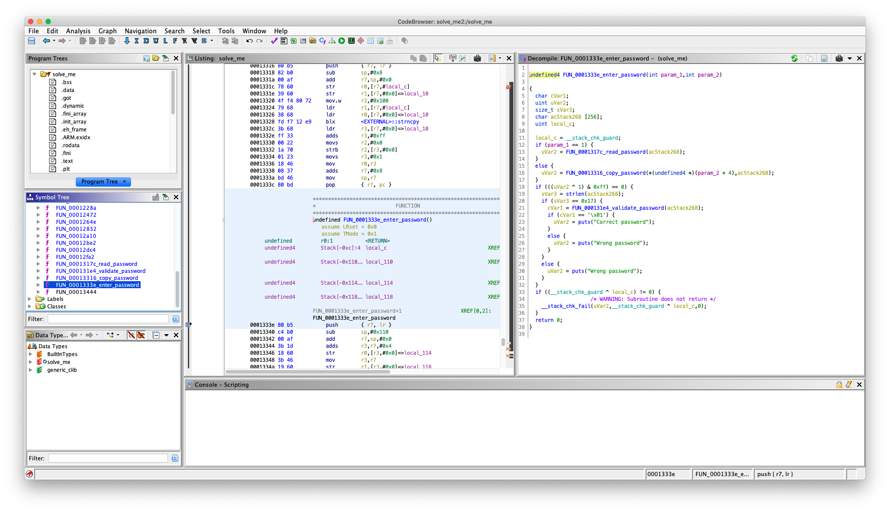
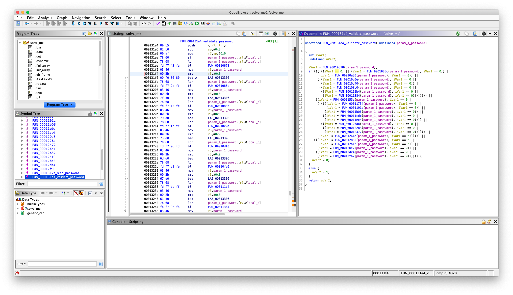
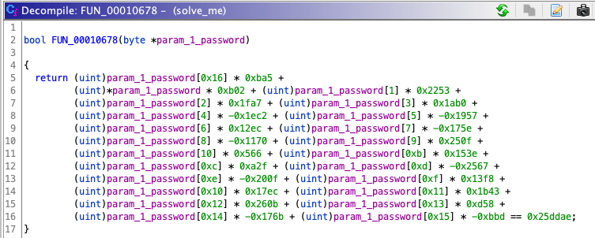

# Tenable Zero Day Assessment - Challenge 4 Writeup - jiva

```
Challenge 4: Solve Me
===
This challenge binary asks for a password.  Reverse engineer the binary and determine the password.  Write-up your approach.

Deliverables:
1. A write up describing how you approached the challenge and found the password (if found).
2. The password (if found).
```

For the final challenge, we're given a 32-bit ARM binary named "solve_me".
```
jiva@mcb0x:~/Desktop/tenable/zero_day_assessment/solve_me $ file solve_me
solve_me: ELF 32-bit LSB shared object ARM, EABI5 version 1 (SYSV), dynamically linked, interpreter /lib/ld-, BuildID[sha1]=7f974e81c0982ce5619ba301a9e65a4fcc2b7b77, for GNU/Linux 3.2.0, stripped
```

Running it from an ARM instance, we see that the binary asks us for a password:
```
root@scw-07f9dc:~/tenable# ./solve_me
Enter the password: i have no idea
Wrong password
```

Let's fire up Ghidra and take a look at what's going on under the hood.



`main()` calls a function which appears to be the password reading/verifying top-level routine at address `0x0001333e`.

Diving into the function at address `0x000131e4` (which I am calling "validate_password"), we see something interesting:



We see an if statement with a lot of function calls in the condition. These functions are all different. Let's take a look at what's going on in one of them:



There are 23 functions in total, and all of them are similar to what can be seen above. Each function takes in the password as input. Then, for each character in the password, it multiplies its ordinal value with a seemingly random number. Then, once those values are added together, if the sum is equal to another seemingly random number, it will return a boolean value of 1 (true) or 0 (false).

While this may seem impossible to solve, this is a pretty good example of the type of problem a SAT solver is designed to solve.

To put it briefly, a SAT solver, or an SMT (Satisfiability Modulo Theories) solver, is a formula solver. That is, given a first-order logic formula, the solver will determine if the formula is satisfiable.

One such SMT solver is called [Z3](https://github.com/Z3Prover/z3) (written by Microsoft). In addition to being able to tell you if a formula is satisfiable, it is able to give you concrete values for each of the symbolic variables in your formula. It's a really powerful SMT solver that's particularly cherished in the reverse engineering community.

I'll be using the Z3 python API to solve this challenge (`pip install z3-solver`). We need to model our problem into a format that Z3 can accept. To begin, I'll go through each of the functions and copy out each constraint. I'll also clean up the variable names created by Ghidra. Here's an example of one of the constraints that I've cleaned up and prepped for use in Z3:
```
pw22 * 0xba5 + pw0 * 0xb02 + pw1 * 0x2253 + pw2 * 0x1fa7 + pw3 * 0x1ab0 + pw4 * -0x1ec2 + pw5 * -0x1957 + pw6 * 0x12ec + pw7 * -0x175e + pw8 * -0x1170 + pw9 * 0x250f + pw10 * 0x566 + pw11 * 0x153e + pw12 * 0xa2f + pw13 * -0x2567 + pw14 * -0x200f + pw15 * 0x13f8 + pw16 * 0x17ec + pw17 * 0x1b43 + pw18 * 0x260b + pw19 * 0xd58 + pw20 * -0x176b + pw21 * -0xbbd == 0x25ddae
```

Once our formulas are prepped, the rest is pretty straight forward. You can see my full Z3 solver script in [`PoCs/c4_solver.py`](PoCs/c4_solver.py).

Let's give our script a run:
```
(venv3) root@tenable-zda:~/solve_me# python solver.py
T3nabl3_Z3r0_D4ys_52366
```

Nice! Z3 was able to determine that the constraints were satisfiable and also gave us a concrete example of what characters (i.e. the flag) will satisfy those constraints. Let's give the flag a test against the target binary just to make sure we're square:
```
root@scw-07f9dc:~/tenable# ./solve_me
Enter the password: T3nabl3_Z3r0_D4ys_52366
Correct password
```